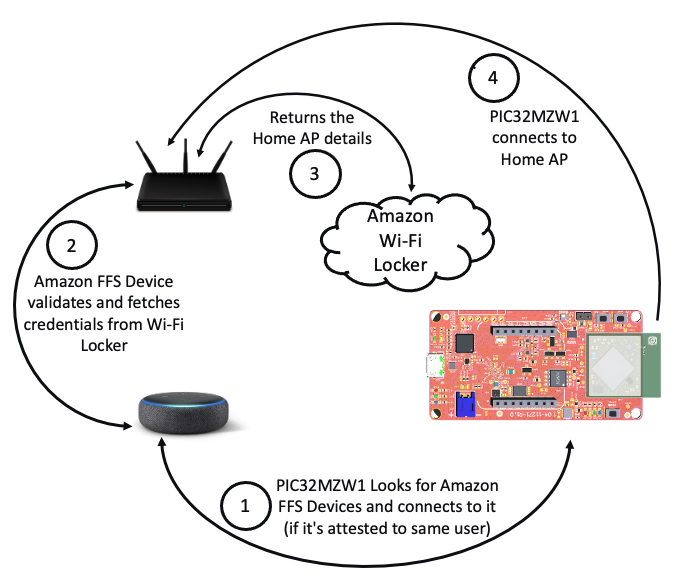

# pic32mzw1_ffs_amazon_freertos
Amazon Frustration Free Setup for PIC32MZW1

## Introduction

The goal of this project is to demonstrate the [Amazon Frustation Free setup](https://developer.amazon.com/docs/frustration-free-setup/understanding-ffs.html) on the PIC32MZW1.

The Amazon Frustation Free Setup(FFS) for WiFi devices is called [**Wi-Fi Simple Setup**(WSS)](https://developer.amazon.com/docs/frustration-free-setup/understand-wi-fi-simple-setup.html), it is designed to provision the new Wi-Fi devices to the Home network without any user interation. 

The Amazon FFS(Wi-Fi Simple Setup) requires, 
- A device [pre-attested](https://developer.amazon.com/docs/frustration-free-setup/provisionee-manufacturing.html#requesting-a-dak-from-amazon) to users Amazon Account
- At least one [Amazon Provisionee device](https://developer.amazon.com/docs/frustration-free-setup/understanding-ffs.html#testing-your-device) connected to internet
- Wi-Fi credentials must be available at Wi-Fi Locker 

On power-up, the FFS capable device tries to connect to available Amazon Provisionee device in the vicinity. The provisionee device bringes up a hidden secured network(SoftAP) and lets the provisionee device to contact 

## Hardware Requirements
- PIC32MZW1 Curiosity or WFI32-IoT board
- [Amazon Provisioner Device](https://developer.amazon.com/docs/frustration-free-setup/understanding-ffs.html#testing-your-device)
- Access Point

## Software Requirements
- MPLABX
- xc32
- Harmony3

## Demo Setup 

## Device Registration
The https://developer.amazon.com/frustration-free-setup/console/v2

## Developer Steps
- Register the Device at 

Contact [microchip-ffs-support@microchip.com](mailto:microchip-ffs-support@microchip.com) for support