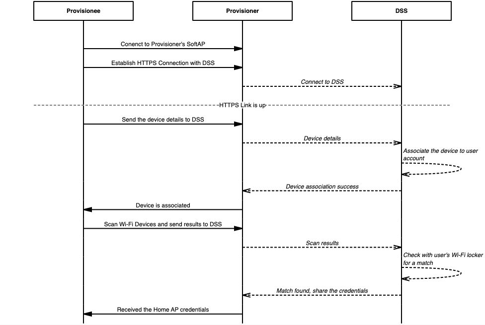
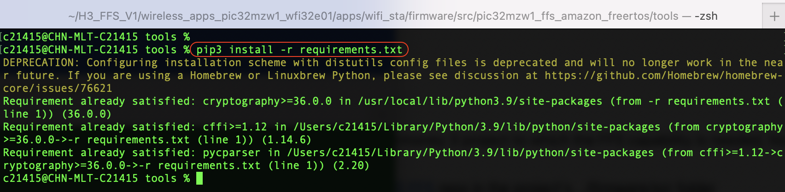
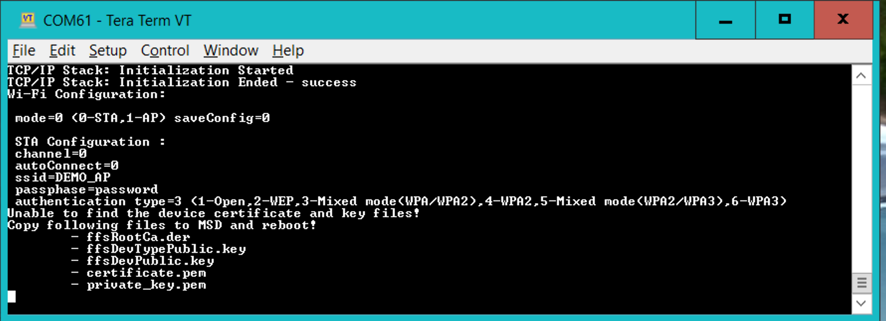
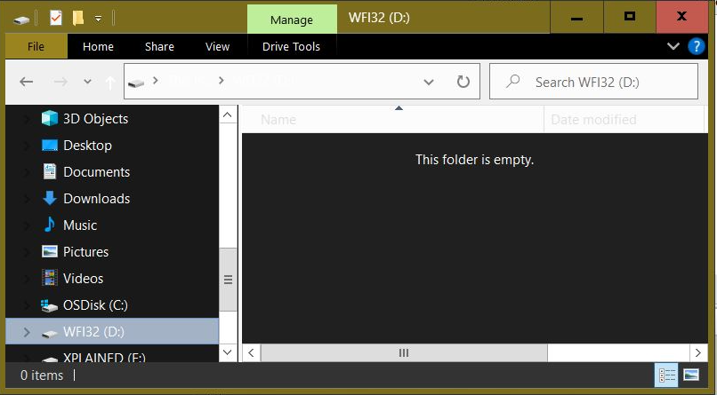
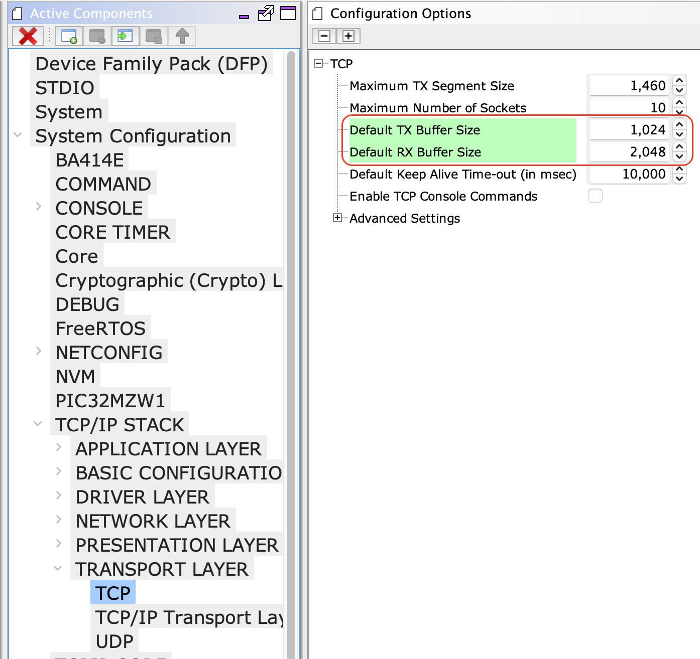
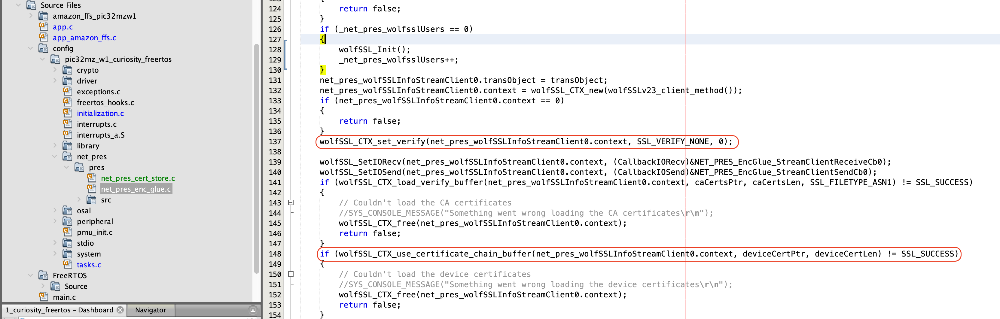
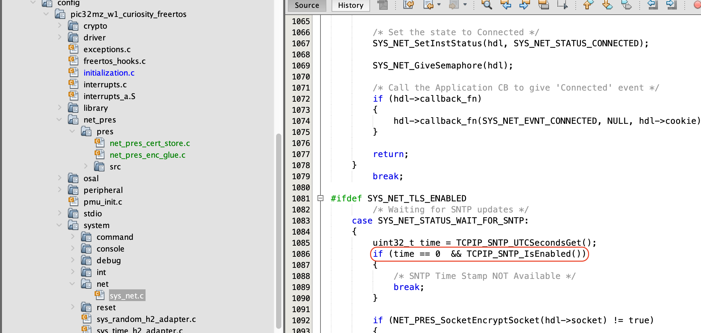
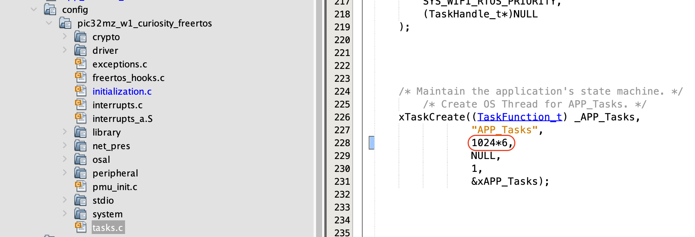
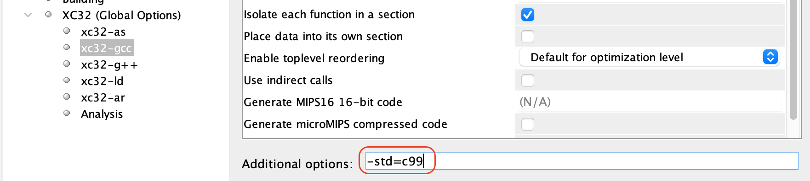

# Amazon Frustration Free Setup for PIC32MZ-W1 / WFI32E01

#### **It is a beta relase package and requires manual code changes, the final release planned for CQ1-2022 will be much simpler**

Devices: **| PIC32 WFI32E | WFI32 | PIC32MZW1 |**

Features: **| Amazon Frustration Free Setup | Wi-Fi Setup Service (WSS) |**

## Introduction

The goal of this project is to demonstrate the [Amazon Frustration Free setup](https://developer.amazon.com/docs/frustration-free-setup/understanding-ffs.html) on the PIC32MZ-W1 / WFI32E01.

The Amazon Frustration Free Setup (FFS) for Wi-Fi devices is called [**Wi-Fi Simple Setup** (WSS)](https://developer.amazon.com/docs/frustration-free-setup/understand-wi-fi-simple-setup.html), it is designed to provision the new Wi-Fi devices to the Home network without any user interaction. 

The Amazon FFS (Wi-Fi Simple Setup) requires, 
- A device(PIC32MZ-W1 / WFI32E01), [pre-attested](https://developer.amazon.com/docs/frustration-free-setup/provisionee-manufacturing.html#requesting-a-dak-from-amazon) with user's Amazon Account
- A Amazon [Provisioner device](https://developer.amazon.com/docs/frustration-free-setup/understanding-ffs.html#testing-your-device) connected to internet
- A Home AP, who has it's credentials saved at [Amazon Wi-Fi Locker](https://www.amazon.com/gp/help/customer/display.html?nodeId=202122980) (a Amazon server)

### Hardware Requirements
- [PIC32MZ-W1 Curiosity](https://www.microchip.com/en-us/development-tool/EV12F11A) or [WFI32-IoT board](https://www.microchip.com/en-us/development-tool/EV36W50A)
- [Amazon Provisioner Device](https://developer.amazon.com/docs/frustration-free-setup/understanding-ffs.html#testing-your-device)
- Access Point with Internet

### Software Requirements
- [MPLAB X IDE](https://www.microchip.com/en-us/development-tools-tools-and-software/mplab-x-ide) (v5.50 or later)
- [MPLAB XC32](https://www.microchip.com/en-us/development-tools-tools-and-software/mplab-xc-compilers) (v2.41 or later)
- [MPLAB Harmony 3](https://www.microchip.com/en-us/development-tools-tools-and-software/embedded-software-center/mplab-harmony-v3)
- [python 3.x](https://www.python.org/downloads/)

	- Note: The project was developed and tested using the MPLAB X v5.50, MPLAB XC32 v2.41 and python 3.9

### MPLAB Harmony 3 Project prerequisite
- FreeRTOS 
- Wolf-SSL 
- NET Service
- Wireles System Service

	- Note:- The FFS demo needs manual modifications in the net and wireless system services. Upcoming release would include these changes and avoid manual code changes that are described in the demo steps. While regenerating the code these manual code changes should not be overwritten.

## Demo Setup 
The FFS demo needs an Amazon Provisionee device (Ex: Alexa Echo Dot), a Home AP, whose credentials are already saved in the Amazon Wi-Fi Locker and a PIC32MZ-W1 / WFI32E01 board running the FFS Demo.

The following diagram shows the FFS demo setup for PIC32MZ-W1 / WFI32E01.

On power up, the PIC32MZ-W1 / WFI32E01 device running FFS demo will compute a unique SSID and passphrase using the given Product ID and Device Type Public Key details. Then it starts a directed scan to find nearby Amazon Provisioner devices, once the Amazon Provisioner device in the vicinity receives scan request, it brings up a hidden secured SoftAP and lets the Provisionee device to connect to it. 

On successful connection, the Provisionee establishes a secured HTTP connection with Device Setup Service (DSS) running on the Provisioner and shares the product details. The DSS will associate the device with the user's Amazon account and proceed with the provisioning process. 

Now the Provisionee will scan and share the available access points in the vicinity with DSS. The DSS would look for a match in the user's Amazon Wi-Fi Locker and shares the Wi-Fi credentials of matching Access point.
The Provisionee will use the received credentials to connect to home AP and update connection status back to the Amazon DSS.

Refer [Understanding Wi-Fi Simple Setup](https://developer.amazon.com/docs/frustration-free-setup/understand-wi-fi-simple-setup.html) for more details. 

### Enabling WSS on PIC32MZ-W1 / WFI32E01
### Device Attestation and Authorization

1. In order to enable FFS, the product (PIC32MZ-W1 / WFI32E01 development board) should be registered at [FFS product registration](https://developer.amazon.com/frustration-free-setup/console/v2/onboard/request-device-registration)
2. The successful registration will provide a unique Product Type ID, Product ID and a DSS public key. Save the DSS public key in a file *device_type_pubkey.pem*

3. Using these information, device specific certificates and keys can be generated. 
4. The Amazon FFS setup provides, [Device Attestation Key(DAK)](https://developer.amazon.com/frustration-free-setup/console/v2/manage-daks) which acts as Provisionee's Certificate Authority.
5. The DAK generates certificate signing request and private key pair, the csr(certificate signing request) will be signed by Amazon. 
6. In the next process, the Device Hardware Authentication (DHA) material is generated which will be signed by DAK.
7. The signed DHA certificate and private key are flashed into the Non Volatile Memory (NVM) of the device.
8. The device product ID and compressed DHA public key extracted from the device certificate should be passed to Amazon throguh the [Test device Template](https://developer.amazon.com/frustration-free-setup/console/v2/manage/submit-test-devices).
9. Amazon will register the device details into the user's Amazon account. It will be used by Amazon Provisionee to compute the SoftAP credentials.
10. Now follow the next section to add Frustration Free Setup (FFS) capability on PIC32MZ-W1 / WFI32E01

## Example Project

A modified and tested example of FFS project for PIC32MZ-W1 / WFI32E01 is available at the [Example](Example/) folder of the repository. The example project uses wifi_sta example as the base.

### Using DHA in PIC32MZ-W1 / WFI32E01 FFS Project
1. The "Device Attestation and Authorization" steps would result in following files
	-  dak.conf
	-  dak-params.pem
	-  dak.csr
	-  dak_private_key.pem
	-  dak-certificate-xxxxxx.pem
	-  device.conf
	-  device-params.pem
	-  device.csr
	-  private_key.pem
	-  **device-certificate.pem**
	-  certificate.pem
	-  dha-control-log-public-key.txt
    -  **device_type_pubkey.pem**

2. Choose the PIC32MZ-W1 MPLAB Harmoney 3 project to which the FFS capability is needed, we suggest to start with *paho_mqtt_tls_client* project.
3. Checkout the [PIC32MZ-W1 FreeRTOS FFS](https://github.com/MicrochipTech/pic32mzw1_ffs_amazon_freertos.git) repo in the project's *../firmware/src* folder
4. Copy the **private_key**, **certificate.pem** and **device_type_pubkey.pem** into the cloned repo *tools* folder.
5. Install the certificate creation python script requirements using the *pip3 install -r requirements.txt*

6. Run the *create-ffs-credentials.py -r SRootCA.cer -c **device-certificate.pem** -k **private_key.pem** -t **device_type_pubkey.pem*** command, it will generate 3 certificate files.

	- ffsRootCA.cer
	- ffsDevPublic.key
	- ffsDevTypePublic.key

 
7. Now we have all the files necessory to configure/enable the FFS

8. The WFI32-IoT emulates a MSD(Mass Storage Devcie) while running the demo for the first time.

9. Copy the above generated files as requested in the above log.

10. Open the project MHC window and navigate to *Active Components -> System Configuration -> TCP/IP Stack -> PRESENTATION LAYER -> Presentation layer*  and change; 
	- The CA certificate and TLS credentials file name to "app.h"
	- Set CA Certificate format to ASN1
	- Modify the CA certificate data variable name to "appData.caCert"
	- Modify the CA certificate Size variable name to "appData.caCert_len"
	- Enable 'Support X509 TLS mutual authentication'
	- Set Device Certificate and Private Key format to ASN1
	- Modify Variable name containing Data for device certificate to "appData.deviceCert"
	- Modify Variable name containing Size of device certificate to "appData.deviceCert_len"
	- Modify Variable name containing Data for device private key to "appData.devicePvtKey"
	- Modify Variable name containing Size of device certificate to "appData.devicePvtKey_len"

- Note: The WSS device certificate generated during the DAK process is a chain certificate and WolfSSL API for chain certificate only accepts PEM format. Hence, even though the 'Device Certificate and Private Key format' in MHC is set to ASN1, only the devicePvtKey is in DER(ASN1) format. The deviceCert will be in PEM format in the generated amazon_ffs_certs.h file.

11. Navigate to *Active Components -> System Configuration -> TCP/IP Stack -> TRANSPORT LAYER -> TCP*  and modify the TCP socket Tx buffer size to 1024 bytes and Rx buffer size to 2048.

- Note: The Tx buffer size increase reduces the Tx re-transmitions from application while sending the scan results to DSS server, it also reduces TLS handshake time and speeds up the FFS time. The Rx buffer increase fixes TLS handshake issue with DSS server and enables PIC32MZ-W1 to share Home AP connection status wtih DSS. 

12. Navigate to *Active Components -> System Configuration -> wolfSSL Library* and enable SNI option. 

13. Navigate to *Active Components -> WIFI SERVICE* and enable the scanning capability and disable  *autoconnect* (Provisionee should not use default connection and connect).

14. Save the MHC configuration and Generate the code

15. Open *net_pres_enc_glue.h* file in project files and set the NET_PRES_SNI_HOST_NAME to "*dp-sps-na.amazon.com*" 

16. The Provisionee device certificate is a chain certificate, hence instead of the wolfSSL_CTX_use_certificate_buffer() call use the wolfSSL_CTX_use_certificate_chain_buffer() in net_press_enc_glue.c. Also move the wolfSSL_CTX_set_verify() call just after the CTX creation.

17. The Amazon Provisioner does not support SNTP requests and hence the FFS demo disables the SNTP functionalities and disables the certificate verify feature. It requires to add TCPIP_SNTP_IsEnabled() check in the Wireless system net service client task, as shown in the below screenshot.

18. In addition, the Amazon DSS server needs to have 'Encrypt then MAC' and 'Extended Master' features of TLS conenction. So, manually add HAVE_EXTENDED_MASTER and HAVE_ENCRYPT_THEN_MAC macros in the configuration.h or user.h(avoids code comparision during MHC code regeneration) file

19. By default the WolfSSL signature verify option is disabled by NO_SIG_WRAPPER macro. FFS demo needs to uncomment NO_SIG_WRAPPER in configuration.h file

20. Download the [WSS over Wi-Fi SDK](https://developer.amazon.com/frustration-free-setup/console/v2/ajax/download/sdk) and add the *../FrustrationFreeSetupCSDK/libffs* library source into the project

21. Add the PIC32MZ-W1 FreeRTOS WSS source (downloaded at step 3) from *../pic32mzw1_ffs_amazon_freertos* (app and src) folder into the project

22. Edit the Device Type ID and Product Unique ID in the *../app/app_amazon_ffs.c file

23. Invoke the FFS_Tasks() from the Applicaiton task 

24. Provided an extra 5KB words of thread stack to accommodate the FFS memory requirements. By default the app task is created in the task.c file of the MPLAB Hamorny 3 project

25. The Amazon FFS library follows c99 C programming languge standard. Add the -std=c99 in the project properties -> xc32-gcc -> Additional options 

26. Add the include path in the project settings and build the project

## Memory Requirements

- The FFS memory consumption on PIC32MZ-W1 are as follows, it includes the Amazon FFS library and PIC32MZ-W1 abstraction layer.

	| Text | Data  |
	|:----------|:----------|
	| 71480    | 3812    |

- The FFS task involves deeper call stack with large local variables. It also needs EC cryptographic computations, To accomodate these memory needs the FFS task needs an extra 5K words of stack memory

## Demo console output
- The FFS Console logs are disabled by default and can be enabled by adding the FFS_DEBUG macro in the preprocessor.
Please refer the [sample console output](Docs/FFSConsoleOutput.log) of the FFS Demo for more details on the provision flow

## Known issues and Limitations

- Enabling FFS_DEBUG pushes a lot of debug prints into the SYS console object. The console UART fails to push out all these bytes through UART Tx interrupt. It is suggested to increase the UART1_WRITE_BUFFER_SIZE (default 1024 bytes) to 2048 or more if the console prints are not clear.

- Lesser than 2048 bytes of TCP RX buffer size results in TLS handshake failure with Amazon DSS server.

 

## FAQ
1. **Can FFS demo work with any Amazon Provisioner device?**

	No, the default FFS demo certificates are linked to  Amazon user's account. The demo will work only with those Amazon Provisioner devices which are logged in with same user's credentials

2. **Can FFS demo work with a Amazon Provisioner device connected to 5GHz router?**

	No, the Amazon Provisioner disables 2.4Ghz when it is connected to 5GHz AP so, the PIC32MZ-W1 would fail to connect to Provisioner device as it only support 2.4GHz.

