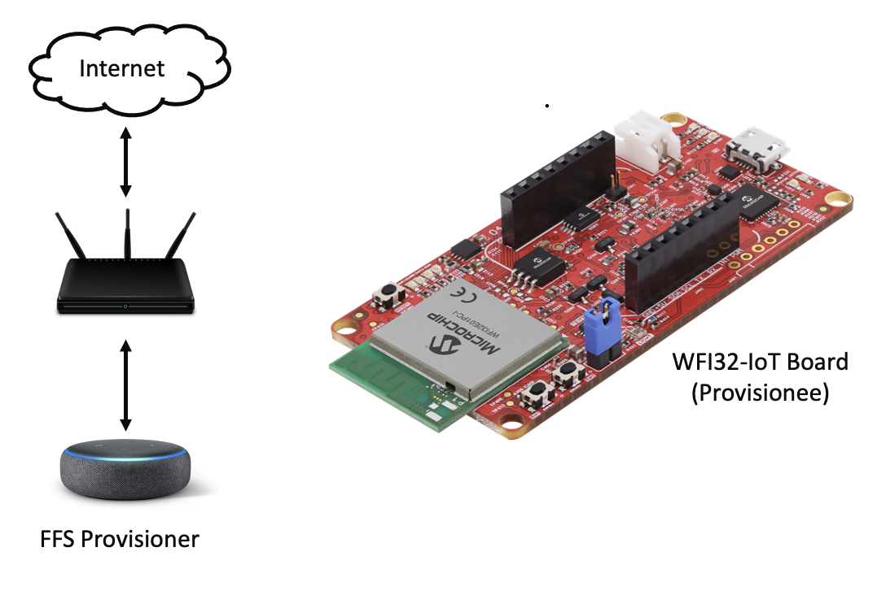
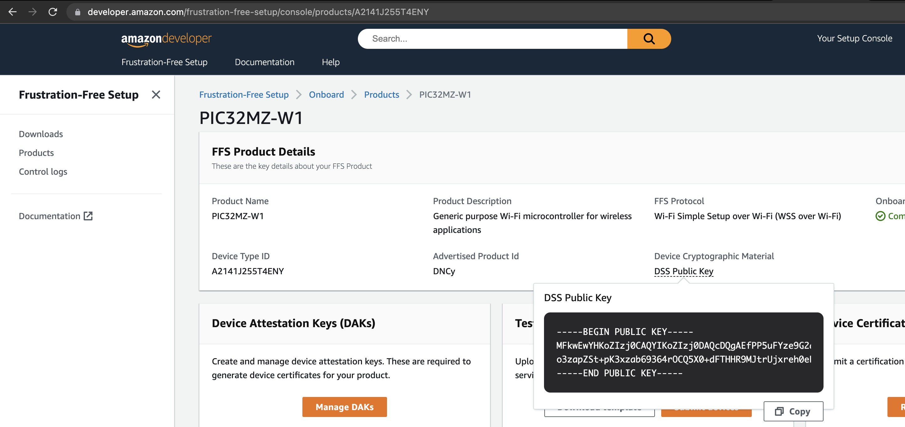
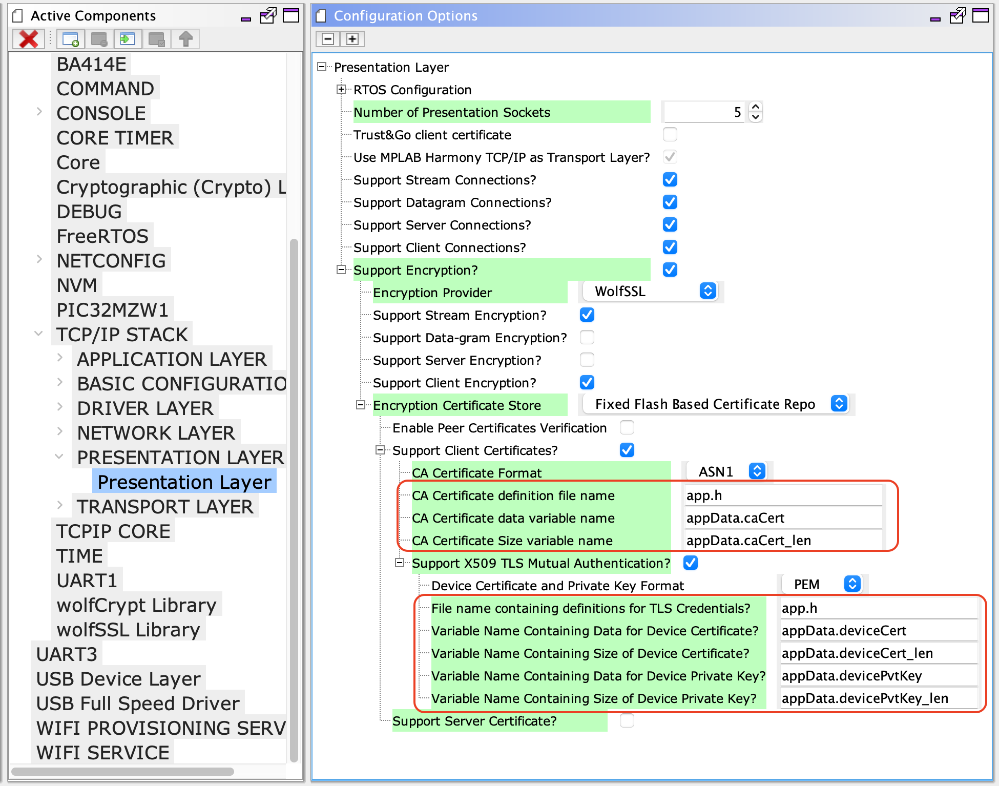
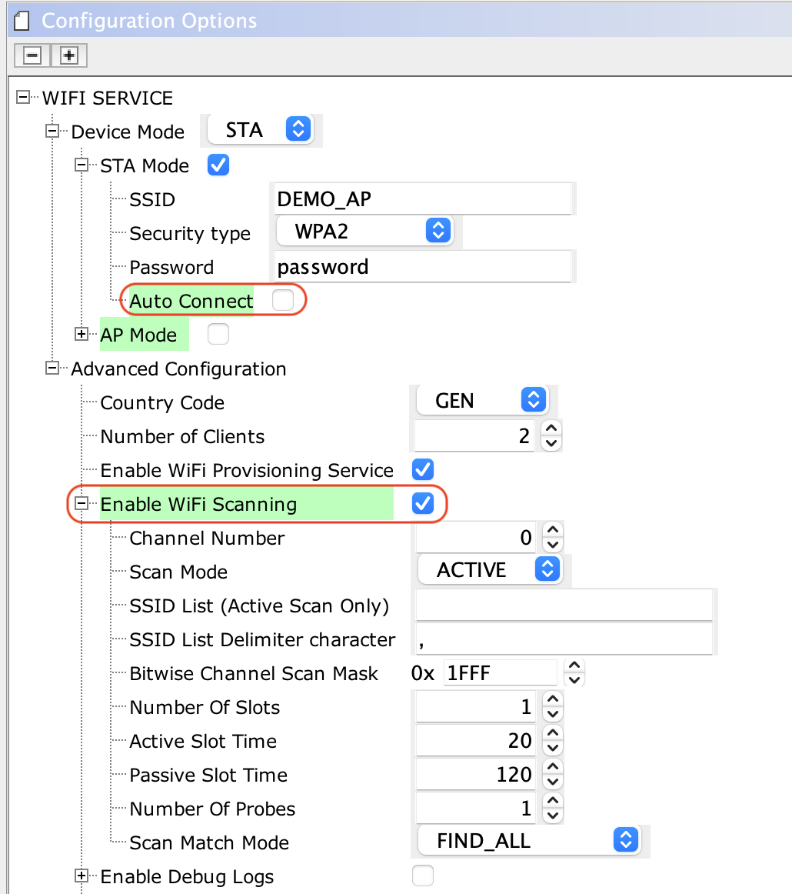

# Amazon Frustration Free Setup for PIC32MZ-W1 / WFI32E01

Devices: **| PIC32 WFI32E | WFI32 | PIC32MZ-W1 |**

Features: **| Amazon Frustration Free Setup| Wi-Fi Setup Service (WSS) |**

## Introduction

The goal of this project is to demonstrate the [Amazon Frustration Free setup](https://developer.amazon.com/docs/frustration-free-setup/understanding-ffs.html) on the PIC32MZ-W1 / WFI32E01.

The Amazon Frustration Free Setup (FFS) for Wi-Fi devices is called [**Wi-Fi Simple Setup** (WSS)](https://developer.amazon.com/docs/frustration-free-setup/understand-wi-fi-simple-setup.html), it is designed to provision the new Wi-Fi devices to the Home network without any user interaction. 

The Amazon FFS (Wi-Fi Simple Setup) requires, 
- A device(PIC32MZ-W1 / WFI32E01), [pre-attested](https://developer.amazon.com/docs/frustration-free-setup/provisionee-manufacturing.html#requesting-a-dak-from-amazon) to users Amazon Account
- At least one [Amazon Provisionee device](https://developer.amazon.com/docs/frustration-free-setup/understanding-ffs.html#testing-your-device) connected to internet
- Wi-Fi credentials must be available at Amazon Wi-Fi Locker 

## Hardware Requirements
- PIC32MZ-W1 Curiosity or WFI32-IoT board
- [Amazon Provisioner Device](https://developer.amazon.com/docs/frustration-free-setup/understanding-ffs.html#testing-your-device)
- Access Point with Internet

## Software Requirements
- [MPLAB XIDE](https://www.microchip.com/en-us/development-tools-tools-and-software/mplab-x-ide) (v5.50 or later)
- [MPLAB XC32](https://www.microchip.com/en-us/development-tools-tools-and-software/mplab-xc-compilers) (v2.41 or later)
- [MPLAB Harmony 3](https://www.microchip.com/en-us/development-tools-tools-and-software/embedded-software-center/mplab-harmony-v3)
- [python 3.x](https://www.python.org/downloads/)

	- Note: The project was developed and tested using the MPLAB X v5.50, MPLAB XC32 v2.41 and python 3.9

## MPLAB Harmony 3 Project prerequisite
- FreeRTOS 
- Wolf-SSL 
- Wi-Fi Service
- Net Service

	- Note:- The FFS demo needs manual modifications in the net and wireless system services. Upcoming release would include these changes and avoid manual changes described in the demo setps. 

## Demo Setup 
The FFS demo needs an Amazon Provisionee device (Ex: Alexa Echo Dot), a Home AP whose credentials are already saved in the Amazon Wi-Fi Locker and a PIC32MZ-W1 / WFI32E01 board running the FFS Demo.

The following diagram shows the FFS demo setup for PIC32MZ-W1 / WFI32E01.

On power up, the PIC32MZ-W1 / WFI32E01 device running FFS demo will compute a unique SSID and passphrase usign the given Product ID and Device Type Public Key details. Then it starts a directed scan to find nearby Amazon Provisioner devices, once the Amazon Provisioner device in the viscinity receives scan request, it brings up a hidden secured SoftAP and lets the Provisionee device to contact to it. 

On successful connection, the Provisionee establishes a secured HTTP connection with Device Setup Service (DSS) running on the Provisioner and shares the product details. The DSS will associate the device with the user's Amazon account and will proceed with the provisioning process. 

Now the Provisionee will scan and share the available access points in the vicinity. The DSS would look for a match in the user's Amazon Wi-Fi Locker, and provides the credentials of the matching Access point.
The FFS device will used the received credentials and connect to home AP and updates the connections status back to the DSS.

Refer [Understanding Wi-Fi Simple Setup](https://developer.amazon.com/docs/frustration-free-setup/understand-wi-fi-simple-setup.html) for more details. 

## Enabling WSS on PIC32MZ-W1 / WFI32E01
#### Device Attestation and Authorization

1. In order to enable FFS, the product (PIC32MZ-W1 / WFI32E01 development board) should be registered at [FFS product registration](https://developer.amazon.com/frustration-free-setup/console/v2/onboard/request-device-registration)
2. The successful registration would provide a unique Product Type ID, Product ID and a DSS public key. Save the DSS public key in a file *device_type_pubkey.pem*

3. The successful registration would enable to generate device certificates and keys
4. The FFS setup provides, [Device Attestation Key(DAK)](https://developer.amazon.com/frustration-free-setup/console/v2/manage-daks) which acts as a Certificate Authority for the FFS devices
5. The DAK generates certificate signing request and private key pair, the csr(certificate signing request) will be signed by Amazon. 
6. In the next process, the Device Hardware Authentication (DHA) material is generated and signed by the DAK.
7. The signed DHA certificate and private key are flashed into the Non Volatile Memory (NVM) of the device
8. The device product ID and compressed DHA public key is extracted from the certificate and submitted to Amazon using the [Test device Template](https://developer.amazon.com/frustration-free-setup/console/v2/manage/submit-test-devices)
9. Amazon will register the device details into the user's Amazon account, and uses them to compute the Provisioner's SoftAP credentials.
10. Now the device is ready for the Frustration Free Setup
#### Using DHA in PIC32MZW1 FFS Project
1. The above steps would result in following files
	-  dak.conf
	-  dak-params.pem
	-  dak.csr
	-  dak_private_key.pem
	-  dak-certificate-xxxxxx.pem
	-  device.conf
	-  device-params.pem
	-  device.csr
	-  **private_key.pem**
	-  device-certificate.pem
	-  **certificate.pem**
	-  dha-control-log-public-key.txt
    -  **device_type_pubkey.pem**
2. Choose the PIC32MZW1 H3 project to which the FFS capability is needed, its good to start with *paho_mqtt_tls_client* project.
3. Checkout the [PIC32MZW1 FreeRTOS FFS](https://github.com/MicrochipTech/pic32mzw1_ffs_amazon_freertos.git) repo in the project's *../firmware/src* folder
4. Copy the **private_key**, **certificate.pem** and **device_type_pubkey.pem** into the cloned repo *tools* folder
5. Run the *create-ffs-credentials.py* command with device certificate and keys files 

6. It will generate the *../app/amazon_ffs_certs.h* which needs be used in the MHC presentation layer configuration
7. Open the project MHC window and navigate to *Active Components -> TCP/IP Stack -> Presentation layer*  and change the file name to amazon_ffs_certs.h. The cert and key variable names will match the default names.

- Note:- The FFS device certificate is a chain certificate and it needs to be in PEM format and wolfSSL_CTX_use_certificate_buffer() call needs to be replaced with wolfSSL_CTX_use_certificate_chain_buffer() in net_press_enc_glue.c
7. The Amazon DSS server needs to have Encrypt then MAC and Extended Master features of TLS conenction and hence manually add HAVE_EXTENDED_MASTER and HAVE_ENCRYPT_THEN_MAC macros in the configuration.h file

8. By default the WolfSSL signature verify option is disabled by NO_SIG_WRAPPER macro. FFS demo needs to uncomment NO_SIG_WRAPPER in configuration.h file

9. Enable SNI option in the wolfSSL library and set the NET_PRES_SNI_HOST_NAME to "*dp-sps-na.amazon.com*" in *net_pres_enc_glue.h* file

10. Make sure the Wi-Fi service has the scanning capability and *autoconnect* is disabled

11. Download the [WSS over Wi-Fi SDK](https://developer.amazon.com/frustration-free-setup/console/v2/ajax/download/sdk) and add the *../FrustrationFreeSetupCSDK/libffs* library source into the project

12. Add the PIC32MZW1 FreeRTOS WSS SDK *../pic32mzw1_ffs_amazon_freertos* (app and src) into the project

13. Edit the Device Type ID and Product Unique ID in the *../app/app_amazon_ffs.c file

14. Invoke the FFS_Tasks() from the Applicaiton task 

15. Add the include path in the project settings and build the project

## Memory Requirements
- The FFS task involves EC cryptographic computations and needs to have around 5K stack memory

### Demo console output
- The FFS Console logs are disabled by default and can be enabled by adding the FFS_DEBUG macro in the preprocessor.
Please refer the [sample console output](Docs/FFSConsoleOutput.log) of the FFS Demo for more details on the provision flow

### FAQ
1. **Can FFS demo work with any Amazon Provisioner device?**

	No, the default FFS demo certificates are linked to  Amazon user's account. The demo will work only with those Amazon Provisioner devices which are logged in with same user's credentials

2. **Can FFS demo work with a Amazon Provisioner device connected to 5GHz router?**

	No, the Amazon Provisioner disables 2.4Ghz when it is connected to 5GHz AP so, the PIC32MZ-W1 would fail to connect to Provisioner device.

