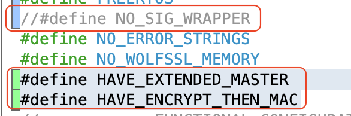
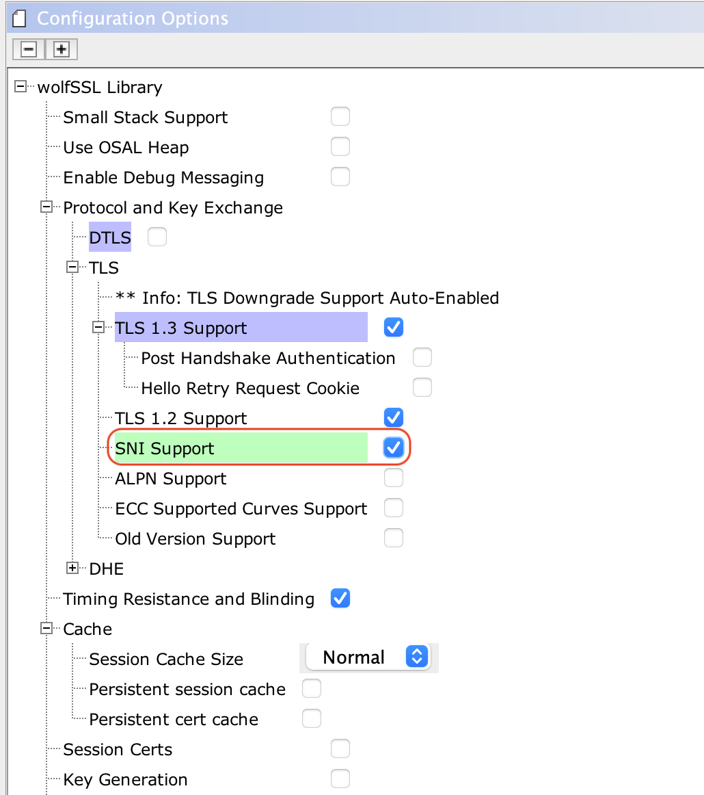

# pic32mzw1_ffs_amazon_freertos
Amazon Frustration Free Setup for PIC32MZW1

## Introduction

The goal of this project is to demonstrate the [Amazon Frustation Free setup](https://developer.amazon.com/docs/frustration-free-setup/understanding-ffs.html) on the PIC32MZW1.

The Amazon Frustation Free Setup(FFS) for WiFi devices is called [**Wi-Fi Simple Setup**(WSS)](https://developer.amazon.com/docs/frustration-free-setup/understand-wi-fi-simple-setup.html), it is designed to provision the new Wi-Fi devices to the Home network without any user interation. 

The Amazon FFS(Wi-Fi Simple Setup) requires, 
- A device [pre-attested](https://developer.amazon.com/docs/frustration-free-setup/provisionee-manufacturing.html#requesting-a-dak-from-amazon) to users Amazon Account
- At least one [Amazon Provisionee device](https://developer.amazon.com/docs/frustration-free-setup/understanding-ffs.html#testing-your-device) connected to internet
- Wi-Fi credentials must be available at Wi-Fi Locker 

## Hardware Requirements
- PIC32MZW1 Curiosity or WFI32-IoT board
- [Amazon Provisioner Device](https://developer.amazon.com/docs/frustration-free-setup/understanding-ffs.html#testing-your-device)
- Access Point

## Software Requirements
- MPLABX
- XC32
- Harmony3
- H3 PIC32MZW1 (Freertos + TLS) 

## Demo Setup 
The folloowing diagram shows the FFS demo setup for PIC32MZW1.

On power-up, the FFS capable device looks for available Amazon Provisionee device in the vicinity, then the provisioner comes up as a hidden secured SoftAP and lets the provisionee device to contact to it. On successful connection, the provisionee establishes a secured HTTP connection with Device Setup Service(DSS) and shares the product details. The DSS will associate the device to user account. Now the provisionee will scan and share the available access pointes with DSS. The DSS would look for a match in the users Amazon Wi-Fi Locker, and provides the credentials for the matching AP.

## Enabling WSS on PIC32MZW1 
#### Device Attestation and Authorization

1. In order enable FFS on any product, the product should be registered at [FFS product registration](https://developer.amazon.com/frustration-free-setup/console/v2/onboard/request-device-registration)
2. The successful registration would provide a unique Device Type ID, Product ID and a DSS public key. Save the DSS public key in a file *device_type_pubkey.pem*

3. The successful registration would enable to generate devcie certificates and keys
4. The FFS setup provides, [Device Attestation Key(DAK)](https://developer.amazon.com/frustration-free-setup/console/v2/manage-daks) which acts as a Certificate Authority for the FFS devices
5. The DAK generates certificate signing request and private key pair, the csr(certificate signing request) will be signed by Amazon. 
6. In the next process, the Device Hardware Authentication(DHA) material is generated and signed by the DAK.
7. The signed DHA certificate and private key are flashed into the NVM of the device
8. The device product ID and DHA public key is extracted from the certificate and shared with amazon through a control log end point
9. Amazon would use these information to register the device into the user's Amazon account 
10. Now the device is ready for the Frustration Free Setup
#### Using DHA in PIC32MZW1 FFS Project
1. The above steps would result in following files
	-  dak.conf
	-  dak-params.pem
	-  dak.csr
	-  dak_private_key.pem
	-  dak-certificate-xxxxxx.pem
	-  device.conf
	-  device-params.pem
	-  device.csr
	-  **private_key.pem**
	-  device-certificate.pem
	-  **certificate.pem**
	-  dha-control-log-public-key.txt
    -  **device_type_pubkey.pem**
2. Choose the PIC32MZW1 H3 project to which the FFS capability is needed
3. Clone the [PIC32MZW1 FreeRTOS FFS](https://github.com/c21415/pic32mzw1_ffs_amazon_freertos.git) repo in the project's *../firmware/src* folder
4. Copy the **private_key**, **certificate.pem** and **device_type_pubkey.pem** into the cloned repo *tools* folder
5. Run the *create-ffs-credentials.py* command with device certificate and keys files 

6. It will generate the *../app/amazon_ffs_certs.h* and it needs be used in the MHC presentation layer configuration, only file name needs to be configured, the cert and key variable names will match the default names.

- Note:- The FFS device certificate is a chain certificate and it needs to be in PEM format
7. The Amazon DSS server needs to have and hence manually add HAVE_EXTENDED_MASTER and HAVE_ENCRYPT_THEN_MAC macros in the configuration.h and comment out NO_SIG_WRAPPER

8. Enable SNI option in the wolfSSL library, and set the NET_PRES_SNI_HOST_NAME to "*dp-sps-na.amazon.com*" in *net_pres_enc_glue.h* file

8. Make sure the Wi-Fi service has the scanning capability and *autoconnect* is disabled

9. Download the [WSS over Wi-Fi SDK](https://developer.amazon.com/frustration-free-setup/console/v2/ajax/download/sdk) and add the *../FrustrationFreeSetupCSDK/libffs* library source into the project

9. Add the PIC32MZW1 FreeRTOS WSS SDK *../pic32mzw1_ffs_amazon_freertos* (app and src) into the project

10. Edit the Device Type ID and Product Uniqut ID in the *../app/app_amazon_ffs.c file

11. Invoke the FFS_Tasks() from the Applicaiton task 

11. Add the inlcude path in the project settings and build the project

### Demo console output

 Contact 
<a href="https://www.w3schools.com/"> microchip-ffs-support@microchip.com</a> for support

